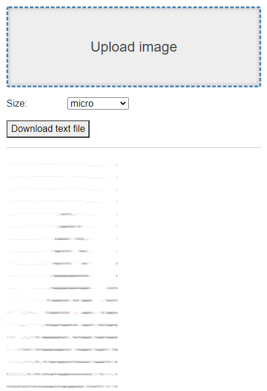

# asciify

_asciify_ takes your digital pictures and turns them into stunning, HTML, text based web pages
using nothing but letters and numbers.  Turn the clock back and view your pictures as ASCII art.

A simple, streamlined, user interface lets you choose an image and select an output size.




_asciify_ features:
* uncluttered, intuitive interface
* color ASCII, HTML output
* choice of output sizes
* download output
* command line interface

Please note that _asciify_ does a LOT of computing, so it will take a while on large images
but the results are worth the wait.

Remember - everything looks better in ASCII!

# Demo
[asciify](https://trevordarcyevans.github.io/asciify/)

# Prerequisites
* .NET Core 6

# Getting started
```bash
git clone https://github.com/TrevorDArcyEvans/asciify.git
cd asciify/
dotnet restore
dotnet build
cd asciify.ui.web
dotnet run
```
open [asciify](http://localhost:7115)
